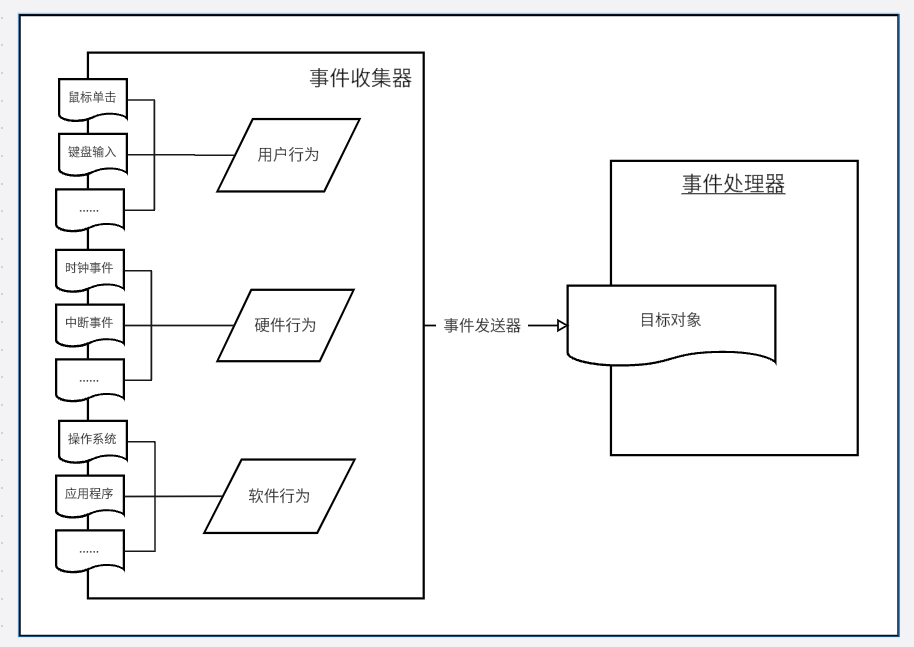

## Nginx 服务器架构初探
- 模块化结构的相关知识
- Nginx 如何处理服务
- Nginx 如何处理Web请求
- Nginx 的事件驱动模型
- Nginx 涉及架构的概览

## 模块化结构
&emsp;&emsp; 什么是"模块化设计呢?" 在计算机领域，针对程序设计，常见的说法是把"模块化设计"定义为"以功能块为单位进行程序设计，实现其秋节算法的方法"。 
&emsp;&emsp; 第①："功能块"是对模块的描述，一个模块就是一个功能块，应该只负责一个功能，在设计模式理论中类似于经常提到的"单一职责原则"。 
&emsp;&emsp; 第②：如果要体现模块化，就免不了将程序进行分解，这也是模块化编程的另一个原则--自顶向下，逐步求精原则。 
&emsp;&emsp; 第③：一个程序被分解为多个模块，那么它们之间一定要存在一定的依赖关系，但是这个依赖不能太强，否则也就不能称之为"模块化"了。于是，又涉及到模块化编程的一条原则：高内聚，低耦合原理。事实上，在设计模式理论中，也有对应的一条设计原理叫"迪米特原则"。 
&emsp;&emsp; 这个提法把"模块化编程"定义为程序设计的一种方法，这种方法的结果是用一系列以功能为单位的算法来描述和实现程序。 
&emsp;&emsp; 模块化设计支持分布式开发。模块化的思想导致大量功能独立的的模块出现，这些模块可以分布在世界上的任何角落。无论是开发中小型的应用程序，还是构建大型的诸如操作系统之类的程序，都可以采用分布式开发模型，集合任何可用模块为己所用。 
&emsp;&emsp; 模块化设计支持团队协同合作。在采用模块化思想进行程序设计时，最终的产品由小的、分散的功能块组成，每一块都是基本独立的。这些功能块可以由不同的团队根据他们自己的时间表和生命周期进行开发，互不影响。最终的产品则可以由另一个独立的个体--发行者进行集成。 
&emsp;&emsp; 模块化设计支持应用扩展和升级。应用模块化思想设计出来的程序，就如同用积木搭起来的房子。各个模块之间既能保持自己的独立性，也能通过接口保持联系。在对应用扩展时，只要实现规范的接口，就可以不断加入新功能；在对其中某些模块进行升级时，只要保持原有接口不变，就能够在不影响其他模块的前提下进行。 

### Nginx 模块化结构
- 核心模块
- 标准HTTP模块
- 可选HTTP模块
- 邮件服务模块
- 第三方模块
&emsp;&emsp; 核心模块是指`Nginx`服务器正常运行必不可少的模块，它们提供了`Nginx`最基本最核心的服务，如进程管理，权限控制，错误日志记录等。 
&emsp;&emsp; 标准`HTTP`模块支持`Nginx`服务器的标准`HTTP`功能。 
&emsp;&emsp; 可选`HTTP`模块主要用于扩展标准的`HTTP`功能，使其能够处理一些特殊的`HTTP`请求； 
&emsp;&emsp; 邮件服务模块主要用于支持`Nginx`的邮件服务。 
&emsp;&emsp; 第三方模块使为了扩展`Nginx`服务器应用，完成特殊功能而由第三方机构或者个人编写的可编译到`Nginx`中的模块。 

### 核心模块
&emsp;&emsp; 核心模块主要包含对两类功能的支持，一类是主体功能，包括进行管理、权限控制、错误日志记录、配置解析等，另一类是用于响应请求事件必需的功能，包括事件驱动机制、正则表达式解析等。

### 标准HTTP模块
- 提供基本`HTTP`服务，常用标准`HTTP`模块见下表。
- 这些模块在默认情况下是被编译到`Nginx`中。

| 模块| 功能 |
|:----:|:----|
| ngx_http_core | 配置端口、`URI`分析、服务器响应错误处理、别名控制以及其他`HTTP`核心事务 |
| ngx_http_access_module | 基于`IP`地址的访问控制(允许/拒绝) |
| ngx_http_auth_basic_module | 基于`HTTP`的身份认证 |
| ngx_http_autoindex_module| 处理以`/`结尾的请求并自动生成目录列表 |
| ngx_http_browser_module | 解析`HTTP`请求头中的`User_Agent`域的值 |
| ngx_http_charset_module | 指定网页编码 |
| ngx_http_empty_gif_module | 从内存创建一个`1 X 1`的透明GIF图片，可以快速调用 |
| ngx_http_fastcgi_module | 对`FastCGI`的支持|
| ngx_http_geo_module | 将客户端请求中的参数转化为键值对变量 |
| ngx_http_gzip_module | 压缩请求响应，可以减少数据传输 |
| ngx_http_header_filter_module | 设置`HTTP`响应头 |
| ngx_http_index_module | 处理以`/`结尾的请求，如果没有找到该目录下的`index`页，就将请求转给`ngix_http_autoindex_module`模块处理；如果`Nginx`服务器开启了`ngx_http_random_index_modeule`模块，则随机选择`index`页 |
| ngx_http_limit_req_module | 限制来自客户端的请求的响应和处理速率 |
| ngx_http_limit_conn_modeule | 限制来自客户端的连接的响应和处理速率 |
| ngx_http_log_module | 自定义`access`日志|
| ngx_http_map_module | 创建任意键值对变量 |
| ngx_http_memcached_module | 对`memcached`的支持|
| ngx_http_proxy_module | 支持代理服务|
| ngx_http_referer_module | 过滤`HTTP`头中`Referer`域值为空的`HTTP`请求 |
| ngx_http_rewrite_module | 通过正则表达式重定向请求 |
| ngx_http_scgi_module | 对`SCGI`的支持 |
| ngx_http_ssl_module | 对`HTTPS`的支持 |
| ngx_http_upstream_module | 定义一组服务器，可以接收来自代理、`fastcgi`、`memcached`的重定向，主要用于负载均衡 |
|

### 可选HTTP模块
- 可选HTTP模块在目前的`Nginx`发行版中只提供源代码，但在快俗编译时默认不编译。如果想使用相关模块，就必须在配置时使用`--with-XXX`参数声明。
- 常用可选`HTTP`模块见下表。

| 模块 | 功能 |
| :----: | :---- |
| ngx_http_addition_module | 在响应请求的页面开始或者结尾添加文本信息 |
| ngx_http_degradation_module| 在低内存的情形下允许`Nginx`服务器返回444错误或者204错误 |
| ngx_http_perl_module | 在`Nginx` 的配置文件中可以使用`Perl`脚本 |
| ngx_http_flv_module | 支持将`Flash`多媒体信息按照流文件传输，可以根据客户端指定的开始位置返回`Flash` |
| ngx_http_geoip_module | 支持解析基于 `GeoIP` 数据库的客户端请求(关于`GEOIP`数据库的细节请查看[GEOIP官方网站](http://www.maxmind.com/)) |
| ngx_google_perftools_module | 支持`Google Performance Tools`(是`Google`公司开发的一套用于C++Profile的工具集，细节请查看其[官方网站](http://code.google.com/p/gperftools/)) |
| ngx_http_gzip_module | 支持在线实时压缩响应客户端的输出数据流 |
| ngx_http_gzip_static_module | 搜索并使用预压缩的以`.gz`为后缀名的文件替代一般文件响应客户端请求 |
| ngx_http_image_filter_module | 支持改变`JPEG`、`GIF` 和 `PNG` 图片的尺寸和旋转方向  |
| ngx_http_mp4_module | 支持将H.264/AAC编码的多媒体信息(后缀名通常为 `mp4`、`m4v` 或 `m4a`)按照流文件传输，常与`ngx_http_flv_modeule`模块一起使用 |
| ngx_http_random_index_module | Nginx接收到以`/`结尾的请求时，在对应的目录下随机选择一个文件作为`index`文件。 |
| ngx_http_secure_link_module | 支持对请求链接的有效性检查 |
| ngx_http_ssl_module | 对`HTTPS/SSL`的支持 |
| ngx_http_stub_status_module | 支持返回`Nginx`服务器的统计信息，一般包括处理连接请求的数量、连接成功的数量、处理的请求数、读取和返回的`Header`信息数等信息 |
| ngx_http_sub_module | 使用指定的字符串替换响应信息中的信息 |
| ngx_http_dav_moduel | 支持`HTTP`协议和`webDAV`协议中`PUT`、`DELETE`、`MKCOL`、`COPY`和`MOVE`方法 |
| ngx_http_xslt_module | 将`XML`响应信息使用`XSLT`(扩展样式表转换语言) 进行转换 |
|

### 邮件服务模块
- 邮件服务是Nginx服务器提供的主要服务之一。和`Nginx`服务器提供的邮件服务相关的模块见下表。

| 模块 | 功能 |
| :----:| :---- |
| ngx_mail_core_module | 提供了`Nginx`邮件程序的核心功能 |
| ngx_mail_pop3_module | 对邮件`POP3`协议的支持 |
| ngx_mail_imap_module | 对邮件`IMAP`协议的支持 |
| ngx_mail_smtp_module | 对邮件`SMTP`协议的支持 |
| ngx_mail_auth_http_module | 基于邮件的身份认证 |
| ngx_mail_proxy_module | 支持邮件代理服务 |
| ngx_mail_ssl_module | 对邮件支持 `HTTPS/SSL` 协议 |
|

### 第三方模块
- 由于Nginx支持自定义模块编程，第三方模块不断得到扩充，功能页非常丰富。
- 在第三方模块的开发者中，深受广大`Nginx`用户推崇的要算是以为笔名为`agentzh`的工程师了。他开发的`echo-nginx-module`模块(支持在`Nginx`配置文件中使用`echo`、`sleep`、`time`、及`exec`等类`Shell`命令)、`memc-nginx-momdule`模块(对标准`HTTP`模块`ngx_http_memcached_module`的扩展，支持`set`、`add`、`delete`等更多的命令)、`rds-json-nginx-module`模块(使`nginx`支持`json`数据的处理)、`lua-nginx-module`模块(使`nginx`支持`lua`脚本语言)等。

### Nginx服务器的Web请求处理机制
- 从涉及架构上来说，`Nginx`服务器是与众不同的。一方面体现在他的模块化涉及，另一方面体现在它对客户端请求的处理机制上。
- `Web`服务器和客户端是一对多的关系，`Web`服务器必须有能力同时为多个客户端提供服务。一般来说，完成并行处理请求工作有三种方式可提供选择：多进程方式、多线程方式和异步方式。

### 多进程方式
&emsp;&emsp; 多进程方式是指，服务器每当接收到一个客户端时，就由服务器主进程生成一个子进程出来和该客户端建立连接并进行交互，直到连接断开，该子进程就结束了。 
&emsp;&emsp; 多进程方式的优点在于，涉及和实现相对简单，各个子进程之间相互独立，处理客户端请求的过程彼此不受到干扰，并且当一个子进程产生问题时，不容易将影响漫延到其他进程中，这保证了提供服务的稳定性。当子线程退出时，其占用资源会被系统操作回收，也不会留下任何垃圾。 
&emsp;&emsp; 缺点是，操作系统中生成一个子进程需要进行内存复制等操作，在资源和时间上回产生一定的额外开销，因此，如果Web服务器接收大量并发请求，就会对系统资源造成压力，导致系统性能下降。 
&emsp;&emsp; 初期的`Apache`服务器就是采用这种方式对外提供服务的。为了应对大量并发请求，`Apache`服务器采用"预生成进程"的机制对多进程方式进行了改进。"预生成进程"的工作方式很好理解，它将生成子进程的时机提前，在客户端请求还没有到来之前就预先生成好，当请求到来时，主进程分配一个子进程和该客户端进行交互，交互完成之后，该进程也不结束，而被主进程管理起来等待下一个客户端请求的到来。改进的多进程方式在一定程度上缓解了大量并发请求情形下`Web`服务器对系统资源造成的压力。但是由于`Apache` 服务器在最初的架构设计上采用了多进程方式，因此这不能从根本上解决问题。 

### 多线程方式
&emsp;&emsp; 多线程方式和多进程方式相似，它是指，服务器每当接收到一个客户端时，会由服务器主进程派生出一个线程出来和该客户端进行交互。 
&emsp;&emsp; 由于操作系统产生一个线程的开销远远小于产生一个进程的开销，所以多线程方式在很大程度上减轻了Web服务器对系统资源的要求。该方式使用线程进行任务调度，开发方面可以遵循一定的标准，这相对来说比较规范和有利于协作。但在线程管理方面，该方式有一定的不足。多个线程位于同一个进程内，可以访问同样的内存空间，彼此之间相互影响；同时，在开发过程中不可避免地要由开发者自己对内存进行管理，其增加了出错的风险。服务器系统需要长时间连续不停地运转，错误的逐渐积累可能最终对整个服务器产生重大影响。 
&emsp;&emsp; `IIS` 服务器使用了多线程方式对外提供服务，它的稳定性相对来说还是不错的，但对于经验丰富的`Web`服务器管理人员而言，他们通常还是会定期检查和重启服务器，以预防不可预料的故障发生。 

### 异步方式
&emsp;&emsp; 异步方式是和多进程方式以及多线程方式完全不同的一种处理客户端请求的方式。 
&emsp;&emsp; 网络通信中的同步机制和异步机制是描述通信模式的概念。`同步机制，是指发送方发送请求后，需要等待接收到接收方发回的响应后，才接着发送下一个请求；异步机制，和同步机制正好相反，在异步机制中，发送方发出一个请求后，不用等待接收方响应这个请求，就继续发送下一个请求。`在同步机制中，所有的请求在服务器端得到同步，发送方和接收方对请求的处理步调是一致的；在异步机制中，所有来自发送方的请求形成一个队列，接收方处理完成后通知发送方。 
&emsp;&emsp; 阻塞和非阻塞用来描述进程处理调用的方式，在网络通信中，主要指网络套接字`socket` 的阻塞和非阻塞的方式，而socket 的实质也就是`IO`操作。`socket的阻塞调用方式为，调用结果返回之前，当前线程从运行状态被挂起，一直等到调用结果返回之后，才进入就绪状态，获取CPU后继续执行；`socket的非阻塞调用方式和阻塞调用方式正好相反，`在非阻塞调用方式中，如果调用结果不能马上返回，当前线程也不会被挂起，而是立即返回执行下一个调用。`  
&emsp;&emsp; 在网络通信中，经常可以看到有人将同步和阻塞等同，异步和非阻塞等同。事实上，这两对概念有一定的区别，不能混淆。两对概念的组合，就会产生出四个新的概念：`同步阻塞`、`异步阻塞`、`同步非阻塞`、`异步非阻塞`。

#### 同步阻塞方式
- 发送方向接收方发送请求后，一直等待响应；接收方处理请求时进行的`IO`操作如果不能马上得到结果，就一直等到返回结果后，才响应发送方，期间不能进行其他工作。例如：在超时排队付账时，客户(发送方)向收款员(接收方) 付款(发送请求) 后需要等待收款员找零，期间不能做其他的事情；而收款员要等待收款机返回结果(`IO`操作)后才能把零钱取出来交给客户(响应请求)，期间也只能等待，不能做其他事情。这种方式实现简单，但是效率不高。

#### 同步非阻塞方式
- 发送方向接收方发送请求后，一直等待响应；接收方处理请求时进行的`IO`操作如果不能马上得到结果，就立即返回，去做其他的事情，但由于没有得到请求处理结果，不响应发送方，发送方一直等待。一直到`IO`操作完成后，接收方获得结果响应发送方后，接收方才进入下一次请求过程。在实际中不适用这种方式。

#### 异步阻塞方式
- 发送方向接收方发送请求后，不用等待响应，可以接着进行其他工作；接收方处理请求时进行的`IO`操作如果不能马上得到结果，就一直等到返回结果后，才响应发送方，期间不能进行其他工作。这种方式在实际中也不使用。
  
  
#### 异步非阻塞方式
- 发送方向接收方发送请求后，不用等待响应，可以继续其他工作；接收方处理请求时进行的`IO`操作如果不能马上得到结果，也不等待，而是马上返回去做其他事情。当`IO`操作完成以后，将完成状态和结果通知接收方，接收方再响应发送方。例如： 客户(发送方) 向收款员(接收方) 付款(发送请求) 后在等待收款员找零的过程中，还可以做其他事情，比如打电话、聊天等；当收款机产生结果后，收款员给客户结账(响应请求)。在四种方式中，这种方式是发送方和接收方通信效率最高的一种。

## Nginx 服务器如何处理请求
&emsp;&emsp; `Nginx` 服务器的一个显著优势是能够同时处理大量并发请求。它结合多进程机制和异步机制对外提供服务。异步机制使用的是异步非阻塞方式。`Nginx`服务器启动后，可以产生一个主进程(`master process`) 和多个工作进程(`worker process`)，其中可以在配置文件中指定产生的工作进程数量。`Nginx`服务器的所有工作进程都用于接收和处理客户端的请求。这类似于`Apache`使用的改进的多进程机制，预先生成多个工作进程，等待处理客户端请求。 
**注意：**  
&emsp;&emsp; 实际上，`Nginx`服务器的进程模型有两种，`Single`模型和`Master-Worker`模型。`Single`模型为单进程方式，性能较差，一般在实际工作中不使用。`Master-Worker`模型实际上被广泛地称为`Master-Slave`模型。在`Nginx`服务器中，充当`Slave`角色的是工作进程。 
 

&emsp;&emsp; 每个工作进程使用了异步非阻塞方式，可以处理多个客户端请求。当某个工作进程接收到客户端的请求以后，调用IO进行处理，如果不能立即得到结果，就去处理其他的请求；而客户端在此期间也无需等待响应，可以去处理其他的事情；当`IO`调用返回结果时，就会通知此工作进程；该进程得到通知，暂时挂起当前处理的事务，去响应客户端请求。 
&emsp;&emsp; 客户端请求数量增长、网络负载繁重时，`Nginx`服务器使用多进程机制能够保证不增长对系统资源的压力；同时使用异步非阻塞方式减少了工作进程在`I/O`调用上的阻塞延迟，保证了不降低对请求的处理能力。 

### Nginx 服务器的事件处理机制
&emsp;&emsp; Nginx 服务器的工作进程调用`IO`后，就去进行其他工作了，当`IO`调用返回后，会通知工作进程。这里有一个问题，IO调用时如何把自己的状态通知给工作进程的呢？ 
&emsp;&emsp; 一般解决这个问题的方案有两种。`一是，让工作进程在进行其他工作的过程中间隔一段时间就去检查一下IO的运行状态，如果完成，就去响应客户端，如果未完成，就继续正在进行的工作；二是，IO调用在完成后能主动通知工作进程。`对于前者，虽然工作进程在进行其他工作的过程中没有等待，但不断的检查仍然在时间和资源上导致了不小的开销，最理想的解决方案是第二种。 
&emsp;&emsp; 具体来说，`select/poll/kqueue` 等这样的的系统调用就是用来支持第二种解决方案的。这些系统调用，也常被称为事件驱动模型，它们提供了一种机制，让进程可以同时处理多个并发请求 ，不用关心`IO`调用的具体状态。`IO`调用完全由事件驱动模型来管理，事件准备好之后就通知工作进程事件已经准备就绪。 

## Nginx 服务器的事件驱动模型
- 事件驱动模型是`Nginx` 服务器保障完整功能和具有良好性能的重要机制之一。

### 事件驱动模型概述
&emsp;&emsp; 事实上，事件驱动并不是计算机编程领域的专业词汇，它是一种比较古老的响应事件的模型，在计算机编程、公共关系、经济活动等领域均有很广泛的应用。顾名思义，事件驱动就是在持续事务管理过程中，由当前时间点上出现的事件引发的调动可用资源执行相关任务，解决不断出现的问题，防止食物堆积的一种策略。在计算机领域，事件驱动模型对应一种程序设计方式，`Event-drivenprogramming`，即事件驱动程序设计。

&emsp;&emsp; 如图所示，事件驱动模型一般是由时间收集器、事件发送器和事件处理器三部分基本单元组成。 
&emsp;&emsp; 其中，事件收集器专门负责收集所有事件，包括来自用户的(鼠标点击、键盘输入事件等)、来自硬件的(如时钟事件等)和来自软件的(如操作系统、应用程序本身等)。事件发送器负责将收集到的事件分发到目标对象中。目标对象就是事件处理器所处的位置。事件处理器主要负责具体事件的响应工作，它往往要到实现阶段才完全确定。 
&emsp;&emsp; 在程序设计过程中，对事件驱动机制的实现方式有多种，这里介绍 `batch programming`，即批次程序设计。批次的程序设计是一种比较初级的程序设计方式。使用批次程序设计的软件，其流程是由程序设计师在设计编码过程中决定的，也就是说，在程序运行的过程中，事件的发生、事件的发送和事件的处理都是预先设计好的。由此可见、事件驱动程序设计更多的关注了事件产生的随机性，使得应用程序能够具备相当的柔性，可以应付种种来自用户、硬件和系统的离散随机事件，这在很大程度上增强了用户和软件的交互性和用户操作的灵活性。 
&emsp;&emsp; 事件驱动程序可以由任何编程语言来实现，只是难易程度有别。如果一个系统是以事件驱动程序模型作为编程基础的，那么，它的架构基本上是这样的：预先设计一个事件循环所形成的程序，这个事件循环构成了如上图所示的"事件收集器"，它不断地检查目前要处理的事件信息，然后使用"事件发送器"传递给"事件处理器"。"事件处理器" 一般运用虚函数机制来实现。 
&emsp;&emsp; 我们日常使用的`Windows`操作系统，就是基于事件驱动程序设计的典型实例。`Windows`操作系统中的视图(通常叫做"窗口")，是我们所说的事件发送器的目标对象。视图接收事件并能够对其进行相应的处理。当我们将事件发送到具体的某一个视图的时候，实际上我们完成了从传统的流线型程序结构到事件触发方式的转变。 

## Nginx 中的事件驱动模型
&emsp;&emsp; `Nginx` 服务器响应和处理`Web`请求的过程，就是基于事件驱动模型的，它也包含事件收集器、事件发送器和事件处理器等三部分基本单元。那么，`Nginx` 服务器是如何使用事件驱动模型来工作的呢？  
&emsp;&emsp; "目标对象"中的"事件处理"可以有以下几种实现办法： 
- "事件发送器"：每传递过来一个请求，"目标对象"就创建一个新的进程，调用"事件处理器"来处理该请求。 
- "事件发送器"：每传递过来一个请求，"目标对象"就创建一个新的线程，调用"事件处理器"来处理该请求。 
- "事件发送器"：每传递过来一个请求，"目标对象"就将其放入到一个待处理事件的列表，使用非阻塞`I/O`方式调用"事件处理器"来处理该请求。 

&emsp;&emsp; 上面三种处理方式，各有特点，`第一种方式，由于创建新的进程的开销比较大，会导致服务器性能比较差，但实现相对简单；第二种方式，由于要涉及到线程的同步，故可能会面临死锁、同步等一系列问题，编码比较复杂；第三种方式，在编写程序代码时，逻辑比前面两种都复杂。大多数网络服务器都采用了第三种方式，逐渐形成了所谓的"事件驱动处理库"`。 
&emsp;&emsp; 事件驱动处理库又被称为多路`IO`复用方法，最常见的包括以下三种：`select`模型、`poll`模型、`epoll`模型。`Nginx`服务器还支持`rtsig`模型、`kqueue`模型、`dev/poll`模型和`eventport`模型。通过`Nginx`配置可以使得`Nginx`服务器支持这几种事件驱动处理模型。 

#### select 库
&emsp;&emsp; `select`库，是各个版本的`Linux`和`Windows`平台都支持的基本事件驱动模型库，并且在接口的定义上也基本相同，只是部分参数的含义略有差异。使用`select`库的步骤一般是:  
&emsp;&emsp; 首先，创建所关注的事件的描述符集合。对于一个描述符，可以关注其上面的读(`read`)事件、写(`write`)事件以及异常发生(`exception`)事件，所以要创建三类事件描述符集合，分别用来收集读事件的描述符、写事件的描述符和异常事件的描述符。 
&emsp;&emsp; 其次，调用底层提供的`select()`函数，等待事件发生。这里需要注意的一点是，`select` 的阻塞与是否设置非阻塞`I/O`是没有关系的。 
&emsp;&emsp; 然后，轮询所有事件描述符集合中的每一个事件描述符，检查是否有相应的事件发生，如果有，就进行处理。 
&emsp;&emsp; `Nginx` 服务器在编译过程中如果没有为其指定其他高性能事件驱动模型库，它将自动编译该库。我们可以使用`--with-select_module` 和`--without-select_module`两个参数强制`Nginx` 是否编译该库。 

#### poll库
&emsp;&emsp; poll库，作为`Linux`平台上的基本事件驱动模型，是在`Linux2.1.23`中引入的。`Windows`平台不支持`poll`库。 
&emsp;&emsp; `poll`与`select` 的基本工作方式是相同的，都是先创建一个关注事件的描述符集合，再去等待这些事件发生，然后再轮询描述符集合，检查有没有事件发生，如果有，就进行处理。 
&emsp;&emsp; `poll`库与`select`库主要区别在于，`select库需要为读事件、写事件和异常事件分别创建一个描述符集合`，因此在最后轮询的时候，需要分别轮询这三个集合。`而poll库只需要创建一个集合`，在每个描述符对应的结构上分别设置读事件、写事件或者异常事件，`最后轮询的时候，可以同时检查这三种事件是否发生`。可以说，`poll`是`select`库的优化实现。 

#### epoll 库
&emsp;&emsp; `epoll`库是`Nginx`服务器支持的高性能事件驱动库之一，它是公认的非常优秀的事件驱动模型，和`poll`库及`select`库有很大的不同。`epoll` 属于`poll`库的一个变种，实在`Linux2.5.44`中引入的，在`Linux2.6`及以上的版本都可以使用它。`poll`库和`select`库在实际工作中，最大的区别在于效率。 
&emsp;&emsp; `poll`库和`select`库，它们的处理方式都是创建一个待处理事件列表，然后把这个列表发给内核，返回的时候，再去轮询检查这个列表，以判断事件是否发生。这样在描述符比较多的应用中，效率就显得比较低下了。一种比较好的做法是，把描述符列表的管理交由内核负责，一旦有某种事件发生，内核把发生事件的描述符列表通知给进程，这样就避免了轮询整个描述符列表。`epoll`库就是这样一种模型。 
&emsp;&emsp; 首先，`epoll`库通过相关调用通知内核创建一个有N个描述符的事件列表；然后给这些描述符设置所关注的事件，并把它添加到内核的事件列表中去，在具体的编码过程中也可以通过相关调用对事件列表中的描述符进行修改和删除。 
&emsp;&emsp; 完成设置之后，`epoll`库就开始等待内核通知事件发生了。某一事件发生后，内核将发生事件的描述符列表上报给epoll库。得到事件列表的`epoll`库，就可以进行事件处理了。 
&emsp;&emsp; `epoll`库在`Linux`平台上是高效的。他支持一个进程打开大数目的事件描述符，上限是系统可以打开文件的最大数目；同时`epoll`库的`IO`效率不随描述符数目增加而线性下降，因为它只会对内核上报的"活跃"的描述符进行操作。 

#### rtsig 模型
&emsp;&emsp; `rtsig` 是 `Real-Time Singnal` 的缩写，是实时信号的意思。从严格意义上说，`rtsig` 模型并不是常用的事件驱动模型，但`Nginx`服务器提供了使用实时信号对事件进行响应的支持，官方文中将`rtsig`模型与其他的事件驱动模型并列，`rtsig` 模型在`Linux 2.2.19`及以上的版本中可以使用。 
&emsp;&emsp; 使用`rtsig`模型时，工作进程会通过系统内核建立一个`rtsig` 队列用于存放标记事件发生(在`Nginx`服务器应用中特指客户端请求发生)的信号。每个事件发生时，系统内核就会产生一个信号存放到`rtsig` 队列中等待工作进程的处理。 
&emsp;&emsp; 需要指出的是，`rtsig` 队列有长度限制，超过该长度后就会发生溢出。默认情况下，`Linux`系统事件信号队列的最大长度设置为1024，也就是同时最多可存放1024个发生事件的信号。在`Linux2.6.6-mm2` 之前的版本中，系统各个进程的事件信号队列是由内核统一管理的，用户可以通过修改内核参数`/proc/sys/kernel/rtsig-max` 来自定义该长度设置。在`Linux2.6.6-mm2` 之后的版本中，该内核参数被取消，系统各个进程分别拥有各自的事件信号队列，这个队列的大小由`Linux`系统的`RLIMIT_SIGPENDING` 参数定义，在执行`setrlimit()`系统调用时确定该大小。`Nginx` 提供了`worker_rlimit_sigpending` 参数用于调节这种情况下的事件信号队列长度。 
&emsp;&emsp; 当`rtsig` 队列发生溢出时，`Nginx`将暂时停止使用`rtsig`模型，而调用`poll`库处理未处理的事件，直到`rtsig` 信号队列全部清空，然后再次启动`rtsig`模型，以防止新的溢出发生。 
&emsp;&emsp; `Nginx` 在配置文件中提供了相关的参数对`rtsig` 模型的使用进行配置。编译`Nginx`服务器时，使用`--with-rtsig_modeule` 配置选项来启用`rtsig` 模型的编译。 

### 其他事件驱动模型
&emsp;&emsp; 除了以上4种主要的事件驱动模型，Nginx服务器针对特定的`Linux`平台提供了响应的事件驱动模型支持。目前实现的主要有`kqueue` 模型、`/dev/poll` 模型和 eventport 模型等。 

#### kqueue 模型
- 是用于支持`BSD`系列平台的高效事件驱动模型，主要用在`FreeBSD 4.1` 及以上版本、`openBSD2.9`及以上版本、`NetBSD2.0`及以上版本以及`Mac OS X`平台上。该模型也是`poll`库的一个变种，和`epoll`库的处理方式没有本质上的区别，都是通过避免轮询操作提供效率。该模型同时支持条件触发(`level-triggered`，也叫水平触发，只要满足条件就触发一个事件)和边缘触发(`edge-triggered`，每当状态变化时，触发一个事件)。如果在这些平台下使用`Nginx`服务器，则建议使用该模型用于请求处理，以提供`Nginx`服务器的处理性能。

#### /dev/poll 模型
- 是用于支持Unix 衍生平台的高效事件驱动模型，其主要在`Solaris7 11/99`及以上版本、`HP/UX 11.22`及以上版本、`IRIX 6.5.15`及以上版本和 `Tru64 UNIX 5.1A` 及以上版本的平台中使用。该模型是`Sun`公司在开发`Solaris`系列平台时提出的用于完成事件驱动机制的方案，它使用了虚拟机的`/dev/poll` 设备，开发人员可以将要监视的文件描述符加入这个设备，然后通过`ioctl()`调用来获取事件通知。在以上提到的平台中，建议使用该模型处理请求。

#### eventport 模型
- 是用于支持`Solaris 10`及以上版本平台的高效事件驱动模型。该模型也是`Sun`公司在开发`Solaris`系列平台时提出的用于完成事件驱动机制的方案，它可以有效防止内核奔溃等情况的发生，`Nginx`服务器为此提供了支持。

### 设计架构概览
&emsp;&emsp; `Nginx` 服务器灵活强大的功能扩展特性时其巨大的优势。前面介绍了`Nginx`服务器的模块，这些模块在功能上彼此独立，在逻辑上又能相互影响、相互联系、共同协作，从而构成一套功能强大完整的服务器程序。那么，`Nginx`服务器是如何达到这样的效果呢？这依赖于`Nginx`服务器的设计架构。 

## Nginx 服务器架构
&emsp;&emsp; Nginx 服务器启动后，产生一个主进程(`master process`)，主进程执行一系列工作后产生一个或者多个工作进程(`worker processes`)。主进程主要进行`Nginx`配置文件解析、数据结构初始化、模块配置和注册、信号处理、网络监听生成、工作进程生成和管理等工作；工作进程主要进行进程初始化、模块调用和请求处理等工作，是`Nginx` 服务器提供服务的主体。 
&emsp;&emsp; 在客户端请求动态站点的过程中，`Nginx` 服务器还涉及和后端服务器的通信。`Nginx`服务器将接收到的`Web`请求通过代理转发到后端服务器，由后端服务器进行数据处理和页面组织，然后将结果返回。 
&emsp;&emsp; `Nginx` 服务器为了提高对请求的响应效率，进一步降低网络压力，采用了缓存机制，将历史应答数据缓存到本地。在每次`Nginx` 服务器启动后的一段时间内，会启动专门的进程对本地缓存的内容重建索引，保证对缓存文件的快速应答。 
&emsp;&emsp; 我们可以将`Nginx` 服务器的结构大致分为主进程、工作进程、后端服务器和缓存等部分。下图展示了各个部分之间的联系和交互。

### Nginx 服务器的进程
- Nginx 服务器的三大类进程：
  - 主进程
  - 由主进程生成的工作进程
  - 为缓存文件建立索引的进程

#### 主进程
- Nginx 服务器启动时运行的主要进程。它的主要功能时与外界通信和对内部其他进程进行管理，具体来说有以下几点：
  - 读取`Nginx` 配置文件并验证其有效性和正确性。
  - 建立、绑定和关闭`Socket`。
  - 按照配置生成、管理和结束工作进程。
  - 接收外界指令，比如重启、升级及退出服务器等指令。
  - 不中断服务，实现平滑重启，应用新配置。
  - 不中断服务，实现平滑升级，升级失败进行会滚处理。
  - 开启日志文件，获取文件描述符。
  - 编译和处理`Perl`脚本。

#### 工作进程
- 由主进程生成，生成数量可以通过`Nginx`配置文件指定，正常请情况下生存于主进程的整个生命周期。该进程的主要工作由以下几项：
  - 接收客户端请求。
  - 将请求依次送入格个功能模块进行过滤处理。
  - IO调用，获取响应数据。
  - 与后端服务器通信，接收后端服务器处理结果。
  - 数据缓存，访问缓存索引、查询和调用缓存数据。
  - 发送请求结果，响应客户端请求。
  - 接收主程序指令，比如重启、升级和退出等指令。

- 工作进程完成的工作还有很多，这里列出了主要的几项。该进程是`Nginx` 服务器提供`Web` 服务、处理客户端请求的主要进程，完成了`Nginx` 服务器的主体工作。因此，我们应该重点监视工作进程的运行状态，保证`Nginx` 服务器对外提供稳定的`Web`服务。

#### 缓存索引重建及管理进程(Cache Loader & Cache Manager)
- `Nginx` 架构示意图中的`Cache`模块，主要由缓存索引重建(`Cache Loader`) 和缓存索引管理(`Cache Manager`)两类进程完成工作。缓存索引重建进程是在`Nginx` 服务启动一段时间之后(默认一分钟)由主进程生成，在缓存元数据重建完成后就自动退出；缓存索引管理进程一般存在于主进程的整个声明周期，负责对缓存索引进行管理。
- 缓存索引重建进程完成的主要工作是，根据本地磁盘上的缓存文件在内存中建立索引元数据库。该进程启动后，对本地磁盘上存放缓存文件的目录结构进行扫描，检查内存中已有的缓存元数据是否正确，并更新索引元数据库。
- 缓存索引管理进程主要负责在索引元数据更新完成后，对元数据是否过期做出判断。
- 这两个进程维护的内存索引元数据库，为工作进程对缓存数据的快速查询提供了便利。

### 进程交互
- `Nginx` 服务器在使用`Master-Worker`模型时，会涉及主进程与工作进程(`Master-Worker`)之间的交互和工作进程(`Worker-Worker`)之间的交互。这两类交互都依赖于管道(`channel`)机制，交互的准备工作都是在工作进程生成时完成的。

#### Master-Worker 交互
- 工作进程是由主进程生成的(使用了`fork`函数)。`Nginx`服务器启动以后，主进程根据配置文件决定生成的工作进程的数量，然后建立一张全局的工作进程表用于存放当前未退出的所有工作进程。
- 在主进程生成工作进程后，将新生成的工作进程加入到工作进程表中，并建立一个单向管道并将其传递给该工作进程。该管道与普通的管道不同，它是由主进程指向工作进程的单向管道，包含了主进程向工作进程发出的指令、工作进程`ID`、工作进程在工作进程表中的索引和必要的文件描述符等信息。
- 主进程与外界通过信号机制进行通信，当接收到需要处理的信号时，它通过管道向相关的工作进程发送正确的指令。每个工作进程都有能力捕获管道中可读事件，当管道中有可读事件时，工作进程从管道读取并解析指令，然后采取相应的措施。这样就完成了`Master-Worker`的交互。

#### Worker-Worker 交互
- `Worker-Worker` 交互在实现原理上和`Master-Worker`交互基本是一样的。只要工作进程之间能够得到彼此的信息，建立管道，即可通信。由于工作进程之间是相互隔离的，因此一个进程想要知道另一个进程的信息，只能通过主进程来设置了。
- 为了达到工作进程之间交互的目的，主进程在生成工作进程后，在工作进程表中进行遍历，将该新进程的`ID`以及针对该进程建立的管道句柄传递给工作进程表中的其他进程，为工作进程之间的交互做准备。每个工作进程捕获管道中可读事件，根据指令采取响应的措施。
- 当工作进程`W1`需要向`W2`发送指令时，首先在主进程给它的其他工作进程信息中找到`W2`的进程`ID`，然后将正确的指令写入指向`W2`的通道。工作进程`W2`捕获到管道中的事件后，解析指令并采取相应措施。这样就完成了`Worker-Worker`交互。

#### Run Loops 事件处理循环模型
&emsp;&emsp; `Run Loops`，指的是进程内部用来不停地调配工作，对事件进行循环处理的一种模型。它属于进程或者线程的基础架构部分。该模型对事件的处理不是自动的，需要在设计代码过程中，在适当的时候启动`Run-Loop`机制对输入的事件做出响应。 
&emsp;&emsp; 该模型是一个集合，集合中的每一个元素称为一个`Run-Loop`。每个`Run-Loop`可运行在不同的模式下，其中可以包含它所监听的输入事件源、定时器以及在事件发生时需要通知的`Run-Loop`监听器(`Run-Loop Obsevers`)。为了监听特定的事件，可以在`Run Loops`中添加相应的`Run-Loop`监听器。当被监听的事件发生时，`Run-Loop`会产生一个消息，被`Run-Loop` 监听器捕获，从而执行预定的动作。 
&emsp;&emsp; `Nginx` 服务器在工作进程中实现了`Run-Loop` 事件处理循环模型的使用，用来处理客户端发来的请求事件。该部分的实现可以说是`Nginx` 服务器程序实现中最为复杂的部分，包含了对输入事件繁杂的响应和处理过程，并且这些处理过程都是基于异步任务处理的。 

### 总结
&emsp;&emsp; `Nginx` 服务器的整体架构中，可以看到，`Nginx` 服务器提供了异步的、非阻塞的`Web`服务，系统中的模块各司其职，彼此之间通常使用网络、管道和信号等机制进行通信，从而保持了松耦合的关系。工作进程中事件处理机制的使用，在很大程度上降低了在网络负载繁重的情况下`Nginx` 服务器对内存、磁盘的压力，同时保证了对客户端请求的及时响应。 
&emsp;&emsp; 在实际使用`Nginx` 服务器过程中，当磁盘没有足够的性能处理大量`IO`调用时，工作进程仍然可能因为磁盘读写调用而阻塞，进而导致客户端请求超时失败等问题。 
&emsp;&emsp; 可以通过多种方法来降低对磁盘`IO`的调用，比如引入异步输入/输出(`Input/Output,AIO`)机制等，但这些方法没有从根本上解决问题。为避免产生这种问题，应当对运行环境有一个基本的了解，针对不同的网络负载环境选择相匹配的硬件环境，并对`Nginx`服务器进行合理的配置。
