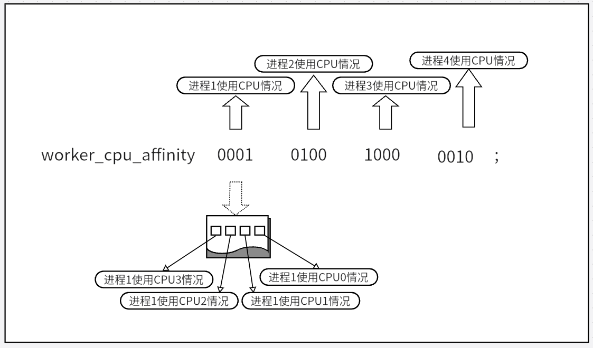

## 针对CPU的Nginx配置优化的2个指令
- 处理器已进入多核时代。多内核是指在一枚处理器中集成2个或多个完整的计算引擎，多核处理器是单枚芯片。一枚多核处理器上可以承载多枚内核，但只需要单一的处理器插槽就可以工作。同时，目前流行的操作系统都已经可以利用这样的资源，将每个执行内核作为分立的逻辑处理器，通过在多个执行内核之间划分任务，在特定的时钟周期内执行更多任务，提高并行处理任务的能力。
- 在Nginx 配置文件中，有这两个指令: worker_processes he worker_cpu_afifinity，它们可以针对多核CPU进行配置优化。


### worker_processes 指令
- 该指令用来设置Nginx服务器的进程数。官方文档建议设置为1即可，赋值太多会影响系统的IO效率，降低Nginx服务器的性能。
- 为了让多核CPU能够很好的并行处理任务，我们将worker_processes指令的赋值适当地增大一些，最好赋值为CPU的倍数。
- 针对双核CPU，建议设置为2或4。
```bash
worker_processes 2;
```


### worker_cpu_affinity 指令
- 该指令用来为每个进程分配CPU的工作内核。如下图所示，worker_cpu_affinity指令的值是由机组二进制值表示的。其中每一组代表一个进程，每组中的每一位表示该进程使用的CPU的情况，1代表使用，0代表不使用。需要注意的是，二进制位排列顺序和CPU的顺序是相反的。建议将不同的进程平均分配到不同的CPU运行内核上。



&emsp;&emsp; 示例，设置Nginx服务的进程数为4，CPU是4核，因此会有4组值，并且每组有4位，所以，此指令的设置为：<br>
```bash
worker_cpu_affinity 0001 0100 1000 0010;
```
&emsp;&emsp; 4组二进制数值分别对应4个进程，第1个进程对应0001，表示使用第一个CPU内核；第2个进程对应0010，表示使用第二个CPU内核，以此类推。<br>
&emsp;&emsp; 若将worker_processes指令的值赋值为8，即赋值为CPU内核个数的2倍，则worker_cpu_affinity指令的设置为：<br>
```bash
worker_cpu_affinity 0001 0010 0100 1000 0001 0010 0100 1000;
```
&emsp;&emsp; 如果一台机器的CPU是8核CPU，并且worker_processes 指令的赋值为8，那么该指令的设置为
```bash
worker_cpu_affinity 00000001 00000010 00001000 00010000 00100000 01000000 10000000;
```
