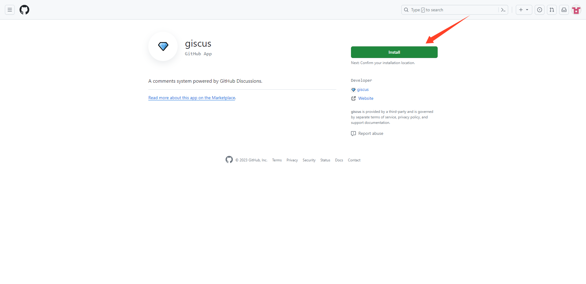
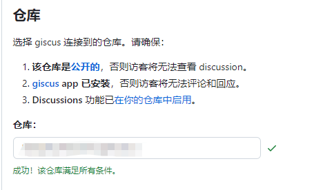
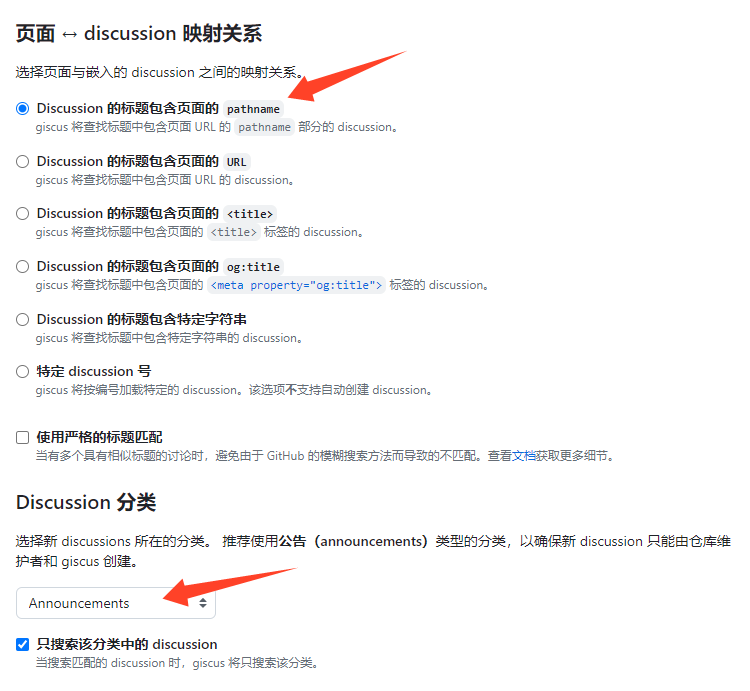
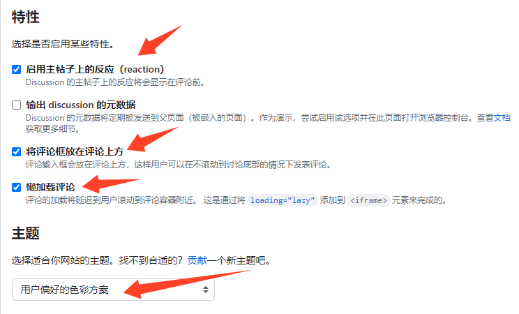

## hugo 评论参考
- [hugo-theme-stack 主题](https://github.com/CaiJimmy/hugo-theme-stack) 


## 本文评论指南
> 本文主要添加以下三个评论系统。
- [Twikoo](https://twikoo.js.org/)
- [Waline](https://waline.js.org/)
- [giscus](https://giscus.app/zh-CN)


## 添加评论
- 首先讲讲如何简单的添加评论，根据主题作者预留评论位置，只需要加一个`comments.html`文件即可。

### 启用评论配置

blowfish主题默认给我们预留了文章评论的功能，需要在配置文件`config/default/params` 中找到`article.showComments`该参数并启用`true`

```bash
[article]
  showComments = true
```

### 登录 [giscus](https://giscus.app/zh-CN) 配置连接仓库
  


- 安装 [giscus app](https://github.com/apps/giscus)





- 复制这段代码，待会有用。


### 添加Giscus评论
- 在博客目录下的`layouts/partials/`这个位置添加`comments.html`文件。
- 然后就OK了。

```
mkdir  layouts/partials/

# 编辑comment.html 文件, 将复制的代码贴进来。
<div class="comment" id="giscus">
<script src="https://giscus.app/client.js"
        data-repo=""         # 仓库地址()
        data-repo-id=""      # 仓库id()
        data-category=""     # 分类名
        data-category-id=""  # 分类id
        data-mapping="pathname"
        data-strict="0"
        data-reactions-enabled="1"
        data-emit-metadata="0"
        data-input-position="top"
        data-theme="preferred_color_scheme"
        data-lang="zh-CN"
        data-loading="lazy"
        crossorigin="anonymous"
        async>
</script>
</div>
```


## 自定义评论
- 需要对主题页面进行一点点修改。
- 扩展评论系统，可以自由选择评论。
- 支持页面和文章区展示评论。
- `single.html` 控制文章布局
- `list.html` 控制列表布局


### 修改主题文章布局配置文件
- 不要动主题下的布局文件
- 在博客目录下的`layouts/_default/`这个位置，添加一个`single.html`文件。

```bash
mkdir layouts/_default/
cp theme/blowfish/layouts/_default/single.html  layouts/_default/
```

- 编辑`layouts/_default/single.html `文件

```bash
    {{ if .Params.showComments | default (.Site.Params.article.showComments | default false) }}
    {{ if templates.Exists "partials/comments.html" }}
    <div class="pt-3">
      <hr class="border-dotted border-neutral-300 dark:border-neutral-600" />
      <div class="pt-3">
        {{ partial "comments.html" . }}
      </div>
    </div>
    {{ else }}
    {{ warnf "[BLOWFISH] Comments are enabled for %s but no comments partial exists." .File.Path }}
    {{ end }}
    {{ end }}


# 将上面这段代码换成下面这样
{{ if .Params.Comments.enable | default (.Site.Params.Comments.enable | default false) }}
{{ $comment := .Params.Comments.provider | default .Site.Params.Comments.provider }}
 {{ $provider := print "partials/Comments/" $comment  ".html" }}
    {{ if templates.Exists $provider }}
    <div class="pt-3">
      <hr class="border-dotted border-neutral-300 dark:border-neutral-600" />
      <div class="pt-3">
        {{ partial $provider . }}
      </div>
    </div>
   {{ else }}
    {{ warnf "[BLOWFISH] Comments are enabled for %s but no $provider partial exists." .File.Path }}
    {{ end }}
    {{ end }}
```


#### 添加评论
- 在博客目录下`layouts/partials/` 创建一个`Comments`目录。
- 评论系统都放到这个目录下，按照评论系统名称命名。例如：giscus评论，则`giscus.html`
  
```bash
mkdir layouts/partials/Comments
cd layouts/partials/
mv comments.html  Comments/giscus.html
```

> 为展示效果，再添加两个评论，Twikoo 和 Waline

<hr>

<hr>

#### 配置Twikoo评论
- 在`layouts/partials/Comments`目录下创建一个`twikoo.html`文件

```bash
# 添加以下内容
    <div id="tcomment"></div>
    <script src="https://cdn.staticfile.org/twikoo/{{ .Site.Params.twikoo.version }}/twikoo.all.min.js"></script>
    <script>
        twikoo.init({
            envId: 'https://xxx.vercel.app', // Twikoo服务端地址
            el: '#tcomment',
            //lang: 'zh-CN',
            //region: 'ap-shanghai', 
            //path: 'pathname',
        });
    </script>
```
<hr>

<hr>

#### 配置Waline评论
- 在`layouts/partials/Comments`目录下创建一个`waline.html`文件

```bash
        <link href="https://unpkg.com/@waline/client@v3/dist/waline.css" rel="stylesheet" />
        <script src="https://unpkg.com/@waline/client@v3/dist/waline.js"></script>      
        
        <div id="waline"></div>    
        <script type="module">    
              import { init } from 'https://unpkg.com/@waline/client@v3/dist/waline.js';
              init({      
              el: '#waline',      
              meta: ['nick','mail','link'],  // 评论属性
              requiredMeta: ['nick','mail'],  //  必填项，昵称与邮件
              login: 'force',                 // 登录后访问
              comment: true,             // 评论数统计 
              placeholder: '欢迎评论',   // 评论框占位提示符
              serverURL: "https://xxx.vercel.app",   // Waline 服务端地址
              avatar: "wavatar",                    // 头像
              avatarCDN: "https://sdn.geekzu.org/avatar/",    // 头像cdn
              pageSize: 10,                  // 评论每页条数
              lang: "zh-CN",                 // 语言
              visitor: true,                 // 文章访问量统计
              highlight: true,               // 代码高亮
              uploadImage: false,            // 评论上传图片功能
              emoji: "https://cdn.jsdelivr.net/gh/walinejs/emojis@1.0.0/weibo"                      // emoji 表情包
              })
        </script>  
```


#### 修改配置文件
- 编辑配置文件`config/_default/params.toml`

```bash
# 在空白处添加以下内容

Comments
  # 是否开启文章评论
  enable = true
  # 全局指定文章评论giscus |twikoo |waline
  provider = "giscus" 
```


- 在文章中也可以控制评论系统，只需要在 `font matter` 处添加
```bash
Comments:
  provider: "waline"
```

### 修改主题页面布局配置文件
- 在博客目录下`layouts/_default/` 添加一个`list.html`文件

```bash
cp theme/blowfish/layouts/_default/list.html  layouts/_default/
```

- 编辑`list.html`文件

```bash
# 在  {{ partial "pagination.html" . }}  这行的下面添加以下内容

{{ if .Params.pageComments.enable | default (.Site.Params.pageComments.enable | default false) }}
{{ $comment := .Params.pageComments.provider | default .Site.Params.Comments.provider }}
    {{ $provider := print "partials/Comments/" $comment  ".html" }}
    {{ if templates.Exists $provider }}
    <div class="pt-3">
      <hr class="border-dotted border-neutral-300 dark:border-neutral-600" />
      <div class="pt-3">
        {{ partial $provider . }}
      </div>
    </div>
    {{ else }}
    {{ warnf "[BLOWFISH] Comments are enabled for %s but no $provider partial exists." .File.Path }}
    {{ end }}
{{ end }}
```


#### 修改配置文件
- 编辑配置文件`config/_default/params.toml`

```bash
# 在空白处添加以下内容

pageComments
  # 是否开启分页评论。不建议全局开启，可在有需要页面开启。
  enable = false
```


### Font Matter 填写
- 文章级别`index.md`
```bash
# 开启
---
Comments:
  enable: true  # 如果全局已开启，这条可以忽略
  provider: "twikoo"
---

# 关闭
---
Comments:
  enable: false
---
```

- 页面级别`_index.md`
```bash
# 开启
---
pageComments:
  enable: true
  provider: "giscus"
---

# 关闭
---
pageComments:
  enable: false
---
```
