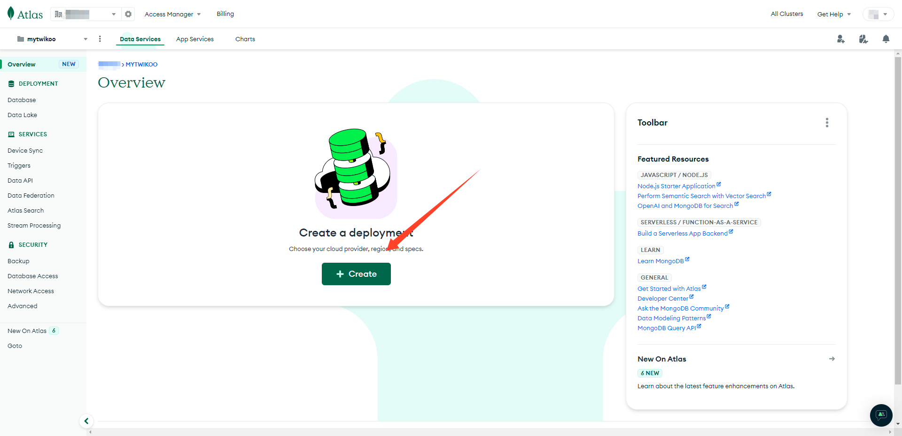
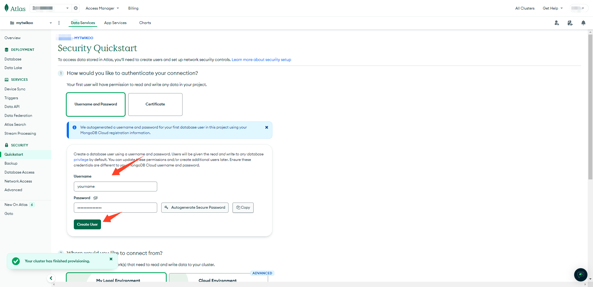
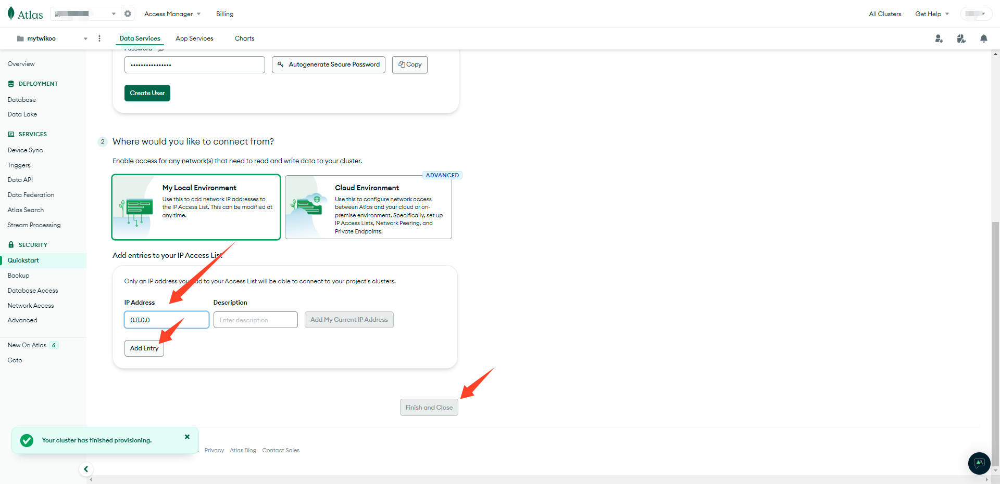
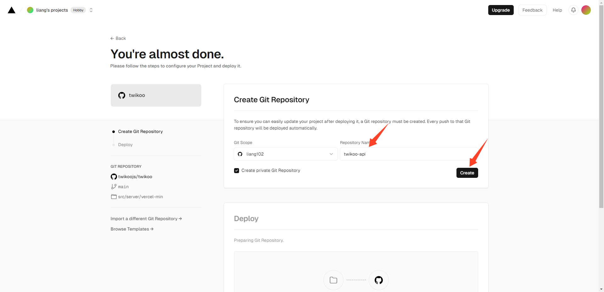
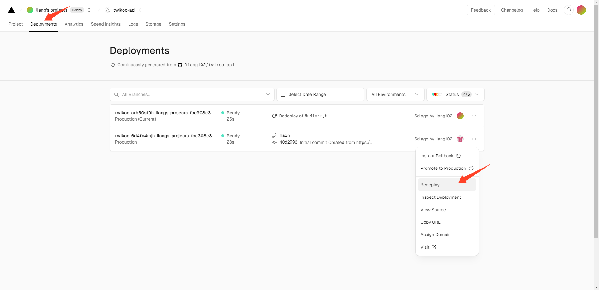
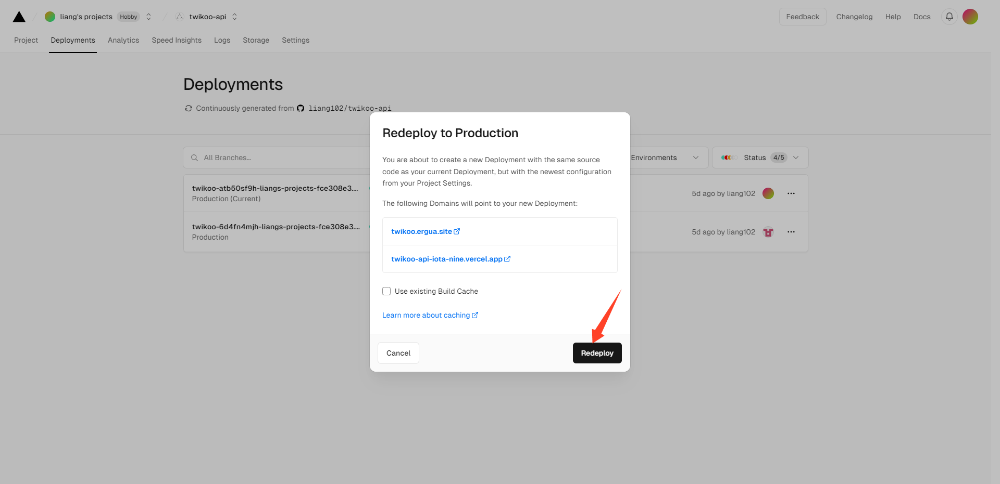
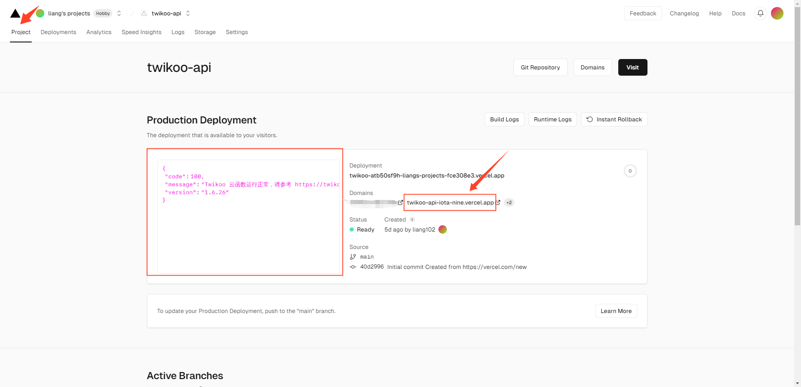
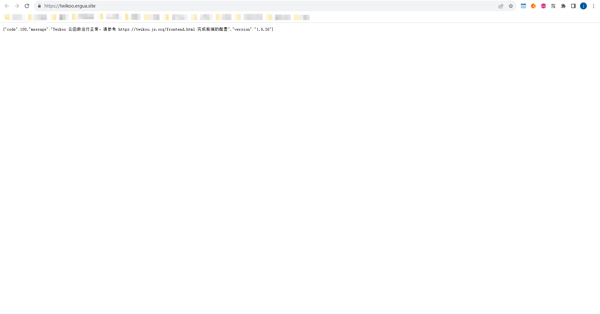

#### Twikoo 评论部署
- 详细配置，请查看 [Twikoo 文档](https://twikoo.js.org/quick-start.html)
- 本教程使用[vercel](https://vercel.com/)部署

1. 注册一个 [MongoDB 账号](https://www.mongodb.com/cloud/atlas/register)
2. 创建一个免费的MongoDB数据库，选择**FREE**类型的，aws厂商提供，地区我这里选择的是香港。

3. 创建一个MongoDB数据库用户。

4. 开放网络地址访问，允许所有网络进行连接。

5. 在 Database 页面点击 Connect，选择 Drivers，复制数据库连接字符串，将连接字符串中的 <username>:<password> 修改为刚刚创建的数据库 用户名:密码。

6. 申请 [Vercel](https://vercel.com/signup) 账号。连接github第三方服务登录。可以在设置中查看和管理三方服务的连接登录。

7. 点击以下按钮将 Twikoo 一键部署到 Vercel

<a href="https://vercel.com/import/project?template=https://github.com/twikoojs/twikoo/tree/main/src/server/vercel-min">
  </img>
</a>

8. 添加环境变量。进入项目设置settings ---- 环境变量Environment Variables，添加环境变量`key: MONGODB_URI  value: 将前面复制的数据库连接字符串粘贴到这里`

9. 修改功能区，无服务器函数的区域，选择与MongoDB数据库相同的地区。我前面MongoDB选择的是香港，这里也选择香港。

10. 重新部署，是环境变量生效

11. 部署成功后会看到云函数运行正常。

12. 配置自定义域名，修改域名DNS解析，将解析cname 到 cname.vercel-dns.com这个域名上，才能访问成功。

