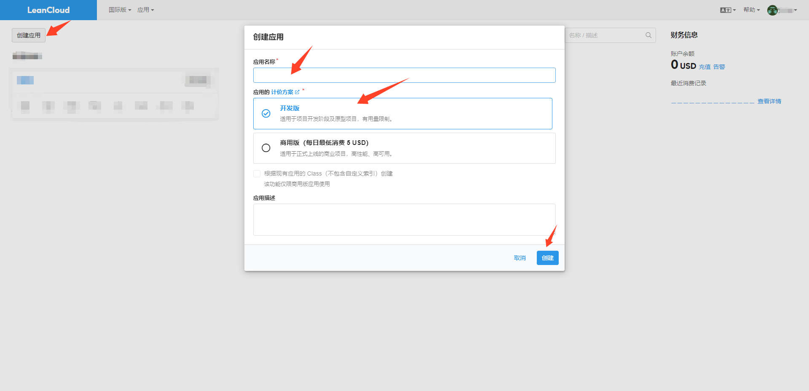
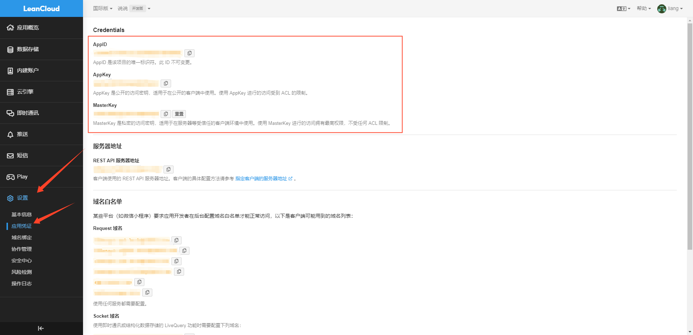

### Waline 评论部署
- 本教程使用 [vercel](https://vercel.com/) 部署，其他部署渠道请查看 [valine配置文档](https://waline.js.org/)

1. 注册一个 [LeanCloud 国际版](https://console.leancloud.app/register) 账号

2. 创建一个应用, 在设置里的应用凭证会看到`AppID  AppKey  MasterKey`，后续会用到。

3. 点击下方按钮，跳转至 Vercel 进行 Server 端部署。跟twikoo 部署步骤一样，这里就不详细说了，创建一个仓库，例如：`valine-api`

<a href="https://vercel.com/new/clone?repository-url=https%3A%2F%2Fgithub.com%2Fwalinejs%2Fwaline%2Ftree%2Fmain%2Fexample">
  </img>
</a>

4. 给该项目添加3个环境变量，LEAN_ID 值对应 AppID, LEAN_KEY 值对应AppKey 和 LEAN_MASTER_KEY 值对应 MasterKey。

5. 重新部署，使环境变量生效。看到评论框代表部署成功。

6. 添加自定义域名，配置域名DNS解析cname 到 cname.vercel-dns.com这个域名上，才能访问成功。如下图。

